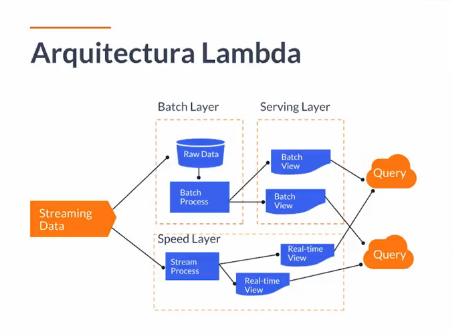
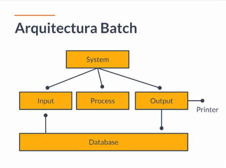

# Curso basico con Big Data

- [IniciandoConBigData](#IniciandoConBigData)
- [Cloud Computing en proyectos de BigData](#CloudComnputingEnProyectos)
- [Introducción al manejo de datos en Cloud](#IntroducciónalmanejodedatosenCloud)
- [Datos Cloud](#DatoCloud)
- [¿Qué nube debería utilizar en mi proyecto de Big Data?](#QueNubeUtilizar)
- [Arquitecturas Lambda](#ArquitecturaLambda)
- [Arquitectura Kappa](#ArquitecturaKappa)
- [Arquitectura Batch](#ArquitecturaBatch)
- [Demo - Creando nuestro IDE en la nube con Python - Boto3](#IDENubePython)
- [¿Cómo usar Boto3?](#CómousarBoto3)
- [API Gateway](#APIGateway)
- [Storage Gateway](#StorageGateway)
- [Kinesis Data Streams](#KinesisDataStreams)
- [Configuración de Kinesis Data Streams](#ConfiguracióndeKinesisDataStreams)
- [DespegandoKinesisconCloudformation](#DespegandoKinesisconCloudformation)
- [AWS - Glue](#AWSGlue)
- [Instalando Apache Zeppelin](#InstalandoApacheZeppelin)
- 
- 
- 
- 
- 
- 
- 
- 
- 
- 
- 
- 
- 
- 
- 
- 
- 

## IniciandoConBigData
- Big Data es un campo orientado al análisis, procesamiento y almacenamiento de grandes cantidades de información que permite mejorar el valor de tu negocio. Utilizando la información mediante este esquema podemos detectar puntos de optimización en diferentes áreas.
- alt + 91 y alt + 93 para crear corchetes

- Los proveedores de servicios de nube son empresas que instalan nubes públicas, gestionan nubes privadas u ofrecen elementos de cloud computing (también llamados servicios de cloud computing) según se soliciten, lo cual incluye las Infraestructuras como servicio (IaaS), las Plataformas como servicio (PaaS)
- Infraestructura como servicio (IaaS) se refiere a los servicios en línea que proporcionan un alto-nivel de APIs utilizadas para indireccionar detalles a bajo nivel de infraestructura como recursos de informática física, ubicación, dato partitioning, scaling, seguridad, copia de seguridad etc.

- Servicio basado en plataforma es una categoría de servicios de computación en la nube que permite a los clientes aprovisionar, instanciar, ejecutar y administrar un paquete modular que comprende una plataforma informática y uno o más aplicaciones, sin la complejidad de construir y mantener la infraestructura típicamente asociada con el desarrollo y lanzamiento de la(s) aplicación(es); y para permitir que los desarrolladores creen, desarrollen y empaqueten dichos paquetes de software .

- Actualmente encontramos diferentes proveedores de Cloud computing con soporte de Big Data, compitiendo entre sí por atraer la mayor cantidad de clientes a sus nubes, destacando Amazon Web Services por sus múltiples servicios para manejo de grandes cantidades de información.

- En este curso aprenderás:

¿Cómo tomar data desde el origen para llevarla a Cloud?
¿Cómo transformar la data?
¿Cómo visualizar la data?
¿Cómo proteger los datos?
Tomando en cuenta tres aspectos importantes:

Automatizar todos los procesos.
Orquestar las distintas tareas.
Involucrar un buen nivel de seguridad sobre nuestros datos.
- Antes de comenzar este curso te sugerimos tomar previamente los cursos de :

Amazon Web Services
Cloud Computing
Storage en AWS
Base de datos en AWS

## CloudComnputingEnProyectos
- vas a aprender a:
   - Cómo tomar data desde el origen para llevarla a Cloud.
   - Cómo transformar la data.
   - Cómo visualizar la data.
   - Tomando en cuenta tres aspectos importantes:

Automatizar todos los procesos.
Orquestar las distintas tareas.
Involucrar un buen nivel de seguridad sobre nuestros datos.
## IntroducciónalmanejodedatosenCloud
- Cunado trabajas en la nube puedes tener un crecimiento escalable"cloud provider", puedes manejar:
  - Cantidad:Nos soportan estas cantidades de datos
             - MetaByte
             - GygaByte
             - TeraByte
             - PentaByte
             - HexaByte
  - Escalabilidad: Crecimiento por demanda, escalabilidad de acuerdo a la cantidad de informacion
  - Automatizacion: Procesos automatizados
  - Eficiencia: Recursos facilmente y al alcande de todos
  ejemplo: nos deben cobrarnos por el uso que se consumo
  - Ahorro: Reduccion de costo de proyectos
  - Flexibilidad: Existen diferentes cloud providers como: GoogleCloudPlatform,Azure, alivaba y hay diferentes tipos de configuracion.
  "se va poder migrar a donde tu quieres rapidamente"

## DatoCloud
Hay algunos puntos importantes que debemos tener en cuenta al momento de manejar nuestra data en un servicio en la nube:

- Debemos seleccionar el servicio que mejor se ajuste a nuestras necesidades de almacenamiento.
- Lo primero que debemos hacer es extraer de otras fuentes la información que vamos a necesitar.
- Debemos validar nuestra información, verificar que sea consistente.
- Verificar los tipos de datos que vamos a extraer.
- Al momento de realizar pruebas a nuestra información debemos utilizar un subset de la data.
- pasos:
  - Extraccion: Extraer y llevarle al mundo cloud
  - Ingesta:Ella envia informacion al cloud y en cloud nosotros reciviremos la informacion y pasaremos a procesarla
  - Validacion de la informacion: Grantizar la consistencia de los datos.
  - Verificaion: Verificar bien el tipo de datos
  - Test:Los test se corren sobre un porcentaje de data para garantizar el proceso que involucra.

## QueNubeUtilizar
Actualmente el mercado de Cloud Computing tiene varios actores compitiendo entre sí por atraer la mayor cantidad de clientes a sus nubes, encontramos Múltiples opciones como: Amazon Web Services, Azure, Alibaba Cloud, Google Cloud Platform, Oracle Cloud, Rackspace, Digital Ocean y Softlayer entre muchas otras.

- Dentro de esta variedad de proveedores muchas veces es complejo tomar decisiones de cuál utilizar, el criterio para esta decisión puede estar dado por diferentes factores como:

  - 1. Costo: Valor de los servicios que serán utilizados en el proyecto.
  - 2. Tipo de pricing: Por demanda (por hora, minuto o segundo), subasta, reservado.
  - 3. Servicios: Variedad de servicios provistos por el cloud provider. ¿Cuál servicio se ajusta mejor a mis necesidades?
  - 4. Ubicación: Distribución de las regiones/zonas donde el cloud provider preste servicios por temas de latencia y experiencia usuario esto puede ser decisivo.
  - 5. Niveles de Servicio: Consultar la documentación por servicio y los niveles ofrecidos de disponibilidad.
  - 6. Soporte: Tipos de soporte, costo, tiempos de respuesta y nivel de soporte (basic, business, enterprise).
  - 7. Estudios de mercado: Revisar los diferentes estudios de mercado, por ejemplo: el cuadrante mágico de Gartner, en los cuales se evalúan en diferentes aspectos los servicios provistos.
  - 8. Documentación: Consultar la documentación de los cloud provider, muchas veces no es muy clara o está incompleta referente a sus servicios.
  

Después de revisar las diferentes opciones que proveen los cloud providers encontramos variedad en servicios de acuerdo a su funcionalidad, otras nubes como Azure, Softlayer, Alibaba también cuentan con servicios orientados al procesamiento de datos, sin embargo dentro de su ecosistema no es tan completo el set de servicios, por tal motivo siempre que pensemos en proyectos de BigData los mejores cloud provider serán AWS y GCP que estudiaras en este curso.

## ArquitecturaLambda
Diseñanda para ser escalable:

- Tiene una gran robustez, puede procesar una alta cantidad de datos. Está compuesta por tres capas:

  - Batch: En esta capa vamos a procesar toda la información almacenada con anterioridad, desde el día anterior hasta meses.
  - Serve: Dentro de esta capa es posible visualizar la data procesada de la capa batch.
  - Speed: Conforme llega la data se va a ir procesando.
  - 

 ## ArquitecturaKappa
 Fue presentada por Jay Krepsen en el 2014 como una evolución de la arquitectura lambda. Elimina la capa batch haciendo que todo se procese en tiempo real.

- La arquitectura Kappa sigue los siguientes pilares:

  - Todo es un stream.
  - Información de origen no modificada.
  - Solo un flujo de procesamiento.
  - Capaz de reprocesar.
  Ejemplo: ver en tiempo real cuantos usuarios estan en la aplicacion y tomar buenas decisiones mas rapida y el comportamiento que tienen los usuarios.
  - 
## ArquitecturaBatch

Es una parte especifica de la arquitectura lamba es importante ver ya que necesitamos saber como funiona en el batch:
- 
- Link: https://www.paradigmadigital.com/techbiz/de-lambda-a-kappa-evolucion-de-las-arquitecturas-big-data/

## IDENubePython
- Documentacion:https://boto3.amazonaws.com/v1/documentation/api/latest/index.html
- Repositorio en github del bot: https://github.com/boto/boto3

- Como crear un ID:
  - Buscamos el srevicio Cloud9
  - Create enviroment
  - creamos nombre
  - Breve descripcion
  - Create instance for enviroment
  - t2.micro
  - after 30 minutos(default)  se va a detener
  - En la parte de networking
  - Para nuestro caso lo dejamos
  - next step
  - Nos mostrar un resumen
  - Create enviroment
  saber como funiona en el batch:
- 
- 
- Con run ejecutamos
- Nos mostrara un consigo json = ojo: poner el pais
- 
## CómousarBoto3
- https://boto3.amazonaws.com/v1/documentation/api/latest/reference/services/ec2.html
- https://docs.aws.amazon.com/es_es/cloud9/latest/user-guide/sample-python.html
- https://boto3.amazonaws.com/v1/documentation/api/latest/reference/services/s3.html
## APIGateway
- Este servicio nos va a servir como puerta de enlace entre la data que tenemos y la plataforma en la nube.

- Soporta cientos de miles de llamadas concurrentes.
Previene ataques DDOS.
- Comparto repositorio en Git con stacks de clodformation para desplegar servicios API Gateway, Lambda Function y DynamoDB con infraestructura como código, que nos sirve para ingesta de información, procesamiento y almacenamiento.
- https://github.com/JoseLuisSR/springboot-aws-serverless
### Como funciona API Gateway? (un ejemplo)

- Supongamos que tiene un sistema de gestion de tickets y quieres procesar todos esos casos para extraer conclusiones que te permitan brindar un mejor servicio
- Puedes configurar para que todos esos ticket, a través de una operación PUT, se envien al API Gateway
- El API Gateway va a ser capaz de tomarlo y enviarlos a una función Lambda
- La función Lambda tiene la capacidad de interactuar, utilizando Python (o cualquier SDK), con cualquiera de los servicios de información que tenemos en adelante (en AWS)
## StorageGateway
- n-premises: En las instalaciones / en local. Se refiere a la utilización de servidores y entornos informáticos propios de la empresa.

- VM: Virtual machine / Máquina virtual.

- VMDK: Virtual machine disk.

- NFS: Network File System. Es un protocolo de nivel de aplicación. Posibilita que distintos sistemas conectados a una misma red accedan a ficheros remotos como si se tratara de locales.

- Tiene tres características importantes:

- Nos permite enviar información desde nuestro datacenter on-premise a la nube.
- Puedes enviar los logs de una aplicación on-premise para que sean procesados.
- Funciona en una máquina virtual que instalamos en nuestro datacenter.
- 
## KinesisDataStreams
Características de Kinesis Data Streams:

Recopila y procesa grandes cantidades de stream de datos en tiempo real. Deben ser gigantescas cantidades de datos (TB, HB, con miles o millones de fuentes de información que alimentan el servicio).
Casos de uso: Procesamiento de logs, social media, market data feeds y web clickstream.
Kinesis Data Streams nos permite hacer agregaciones en el proceso de información; es decir, podemos juntar información, agruparla y hacer ciertas actividades con dicha información mientras es procesada.
Así está compuesto Kinesis Data Streams:

- Data Record: Es la unidad de dato almacenada en Kinesis Data Streams.
Retention period: El tiempo en que la información se mantiene accesible después de ser agregada al stream. Es muy importante tener en cuenta que Kinesis Data Streams no es un servicio para almacenar información, pero podemos contar con un periodo de retención, que por defecto es de 24 horas.
Producer: Es el encargado de poner el Data Record en Kinesis Data Streams.
- Consumer: Toma los Data Records ya procesados de Kinesis Data Streams para alimentar otro sistema de información.
- Shard: Es una secuencia de Data Records dentro de un stream. En la configuración de Kinesis, debemos especificar la cantidad de shards, y la cantidad de shard estará determinada principalmente por la cantidad del flujo de información que tengamos.
Partition key: Se usa para agrupar la información por shard dentro de un stream.
Es así que Kinesis Data Streams se convierte en una parte fundamental de arquitecturas en tiempo real, arquitecturas en las cuales la necesidad principal es procesar millones de datos; se puede crecer N cantidad de shards y procesar de acuerdo a lo que permitan los shards en tamaño.

K- inesis Data Stream nos brinda alta disponibilidad, redundancia y un performance muy alto para manejar grandes cantidades de datos en tiempo real.
## ConfiguracióndeKinesisDataStreams
- Buscamos Kinesis
- Sleccionamos kinesis data stream
- 
- Creamos
- Le asignamos la cantidad de shars es mu importante para el tiempo
- 
- lE DAMOS EN EL BOTON Y SE CARGARA NUESTRO KINESIS
- 
- Debemos activar el cifrado:
- 
- Tener en cuenta:
- Cantidad de shards ( particiones de memoeria)
- Perido de retencion
- Encrypcion
- La parte de login que es la parte mas importante
## DespegandoKinesisconCloudformation
- entrar a la carpeta cfn-kinesis-master para ver el codigo a ejecutar en aws para kinesis
## AWSGlue

## InstalandoApacheZeppelin
- Apache Zeppelin es un servicio que permite la ejecución de notebooks para análisis de datos utilizando SQL, Scala o Python. Tiene integración con los servicios de AWS.
- Instalar:
  - Buscar en google apache zeppelin
  - https://www.apache.org/dyn/closer.cgi/zeppelin/zeppelin-0.8.2/zeppelin-0.8.2-bin-all.tgz
  - damos clien en We suggest the following site for your download: y se descargarar
  - Luego l descomprimimos
  - Entramos al cmd y nos ubicamos donde se encuentra la carpeta de zeppelin descomprimida
  - 
  - otra forma de installar es = winget install zeppelin
  - Luego debemos tener java instalado sino no va funcionar
  - Para windows se inia zeppelin con " zeppelin.cmd" link de como installar aqui https://zeppelin.apache.org/docs/0.8.1/quickstart/install.html#starting-apache-zeppelin
  - y le damos entrer porque se va parar el cmd
    - 
    - Finalmente nos saldra la pantalla del localhost:8080
    - 
  - Creamos un notebook
  - 
  - 
  - 
